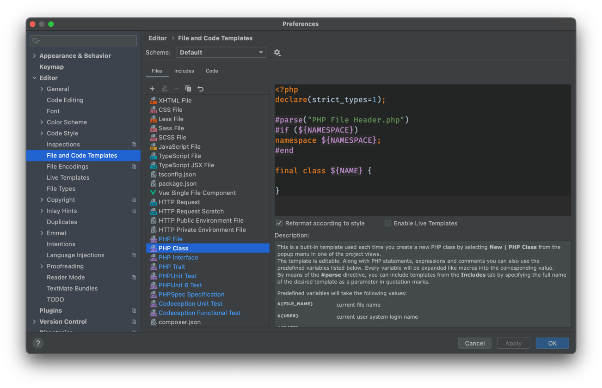
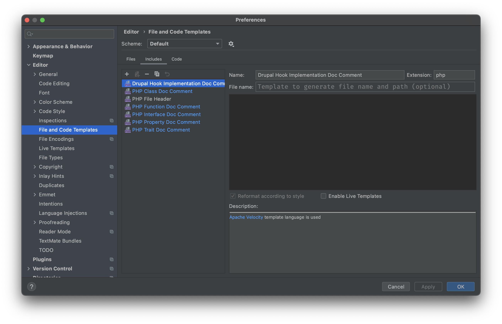
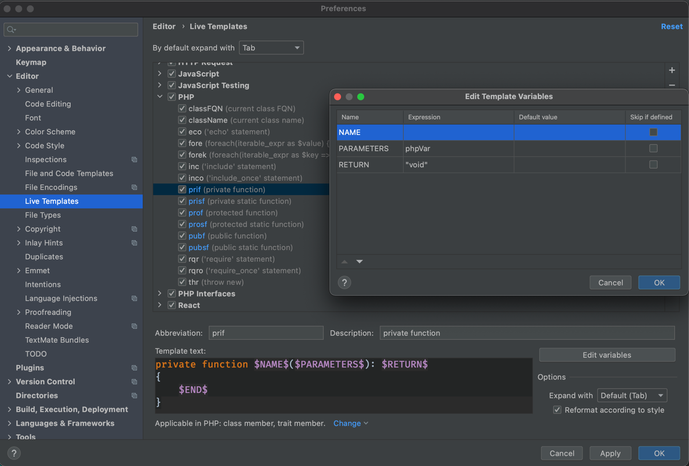

[Back to technical skills](../technical-skills)

# IDE

- [Plugins](#plugins)
- [Code Templates](#code-templates)
- [Live Templates](#live-templates)

## [PhpStorm](https://www.jetbrains.com/phpstorm/)

> The Lightning-Smart PHP IDE

It provides the best code completion, refactorings, on-the-fly error prevention, and more.

### Plugins
<div style="overflow-x:auto;">
<table>
<colgroup>
   <col span="1" style="width: 85%;">
   <col span="1" style="width: 15%;">
</colgroup>
<tbody>
    <tr>
        <td>
            <h4>
                <a href="https://plugins.jetbrains.com/plugin/7622-php-inspections-ea-extended-" title="Php Inspections">
                    Php Inspections (EA Extended)
                </a>
            </h4>
            <ul>
                <li>Architecture related issues</li>
                <li>Weak types control and possible code simplifications</li>
                <li>Non-optimal, duplicate and suspicious conditions</li>
                <li>Validation of magic methods usage</li>
                <li>Performance, compatibility & security issues</li>
                <li><a href="https://github.com/kalessil/phpinspectionsea"> Github Repository</a></li>
            </ul>
        </td>
        <td>
            <a href="https://plugins.jetbrains.com/plugin/7622-php-inspections-ea-extended-" title="Php Inspections">
                
            </a>
        </td>
    </tr>
    <tr>
        <td>
            <h4>
                <a href="https://plugins.jetbrains.com/plugin/9792-key-promoter-x" title="Key Promoter X">
                    Key Promoter X
                </a>
            </h4>
            <ul>
                <li>It helps you to learn essential shortcuts while you are working</li>
                <li>Its shows you the actions you use the most and directly provides you with their shortcut</li>
                <li><a href="https://github.com/halirutan/IntelliJ-Key-Promoter-X"> Github Repository</a></li>
            </ul>
        </td>
        <td>
            <a href="https://plugins.jetbrains.com/plugin/9792-key-promoter-x" title="Key Promoter X">
                
            </a>
        </td>
    </tr>
</tbody>
</table>
</div>

### Code Templates

They are a built-in templates used each time you create a new PHP class by selecting `New | PHP Class` from the popup menu in one of the project views.

#### Preferences → Editor → File and Code Templates

---

**`Files` tab:**



- Add `declare(strict_types=1);` just after the `<?php` tag
- Also, add the `final` keyword to the classes by default

Example:
```php
<?php
#parse("PHP File Header.php")

#if (${NAMESPACE})

namespace ${NAMESPACE};

#end

class ${NAME} {

}
```
transformed to:
```php
<?php
declare(strict_types=1);

#parse("PHP File Header.php")
#if (${NAMESPACE})
namespace ${NAMESPACE};
#end

final class ${NAME} {
    
}
```
---

**`Includes` tab:**


Remove the content from all files except from: `PHP Property Doc Comment`

You can use:
```php
/**
 * @var ${TYPE_HINT}
 */
```
**Or** the shorter version:
```php
/** @var ${TYPE_HINT} */
```
---

**`Code` tab:**


Remove from this tab the default comments for the following sections:
- PHP Constructor
- PHP Fluent Setter Method
- PHP Getter Method
- PHP Setter Method

```php
/**
 * ${CLASS_NAME} constructor.
 * ${PARAM_DOC}
 * ${THROWS_DOC}
 */
public function __construct(${PARAM_LIST}) {${BODY}}
```

simplify to:

```php
public function __construct(${PARAM_LIST}) {${BODY}}
```

### Live Templates



Add `: $RETURN$` to the following shortcuts:

```php
public function $NAME$($PARAMETERS$) {
    $END$
}
```
transform to:
```php
public function $NAME$($PARAMETERS$): $RETURN$
{
    $END$
}
```

Then, press on the button `Edit variables` and place `"void"` on RETURN expression like the picture.

This is the list of the items you have to change:

- prif
- prisf
- prof
- prosf
- pubf
- pubsf

Optionally, you can do the same with `PHP Interfaces` checkbox.
